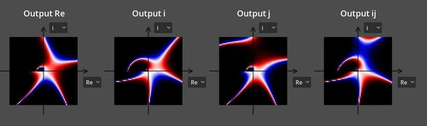
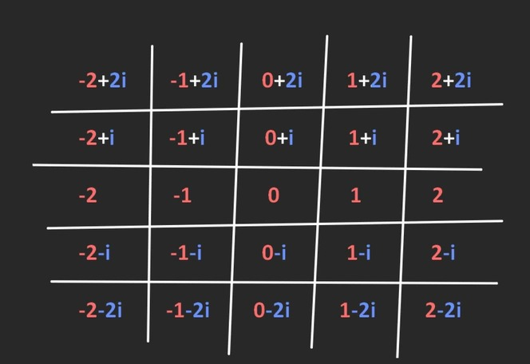
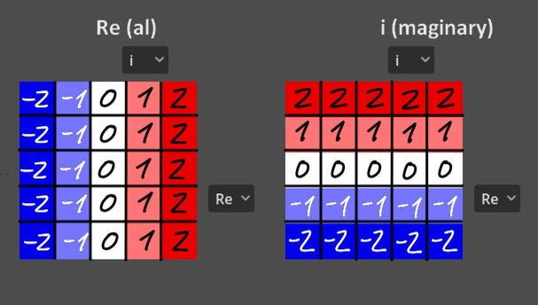
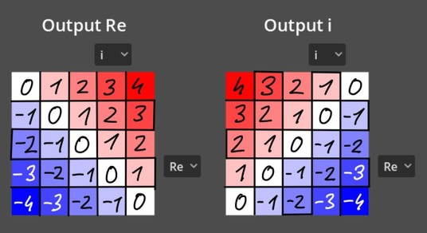
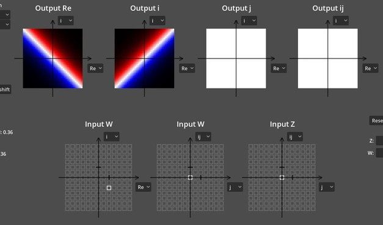
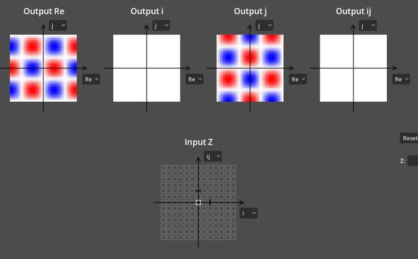
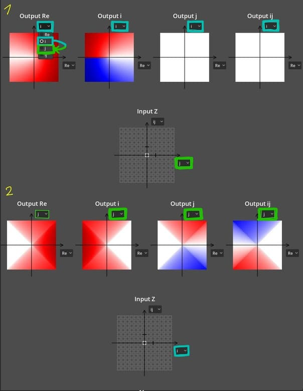
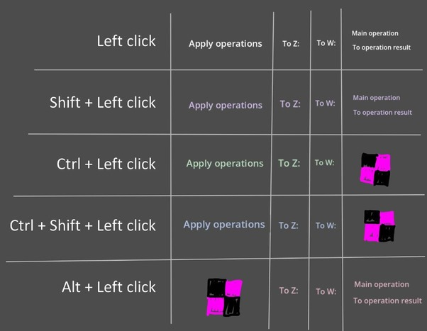

# Bicomplex Visual Calculator

### Enables a more visual, accessible approach to complex algebras.

## Download

- **Downloads:** [https://github.com/starphene/bicomplex-visual-calculator/releases]
- **Web Version:** [https://starphene.github.io/bicomplex-visual-calculator/]  

## Overview 

This is a tool which allows visualization of bicomplex numbers in a millions of differently customizable ways. There are no rules.   
The intended usage is for you to change random things without having any idea what you're doing and enjoy the results.   
No math knowledge or brain required. There's an almost nonexistent skill floor. Just test random operations together and adjust the visuals to your liking.   
You define an operation to apply, define the one or two variables to apply that operation to, and enjoy the result, or modify its visuals to your content.   

For a simple explanation, what happens if we take a 5x5 grid of gaussian integers from -2-2i to 2+2i and visualize it in a beautiful way? 

*(i² = -1)*

We can visualize this grid by assigning a color to each number according to this gradient to the right of the screenshot, and drawing a new grid where each cell has the new color instead of the new number.  
But since complex numbers are defined by 2 numbers, we need 2 of them to properly visualize all these numbers.

However, what if we multiply each number on the grid (Z) by a constant like -1+i? The numbers get changed to something else, and the visualization becomes altered: 

And that's the jist of the program. You can alter the exact operation using the UI in top left and the value of the constant (W) with the gray grids under the rainbow ones.  
The reason why you'll mostly see high resolution screenshots of the outputs is because modern technology allows us to work with way bigger grids than that.  
The default size is actually 39x39, and so the same result in the greater resolution looks way more informative and readable:

That's the jist of it. However, the program was designed to work with bicomplex numbers in mind, a seamless 4-dimensional merger of complex (i² = -1) and split complex numbers (j² = 1, but j is separate from +-1).    
This doesn't really complicate the architecture that much, it just expands the required amount of output grids to 4 and the number of input grids to 3.   
But since complex and split complex numbers work near-perfectly within bicomplex numbers, we can just make the program work with pure split or pure complex numbers just like we just did right now.    

Split-complex numbers also have a lot of output values which are only defined in bicomplex numbers (for example, the square root of j, which is 0.5 + 0.5i + 0.5j - 0.5ij), so don't be alarmed if you think the answer makes no sense.  
(unless it mathematically doesn't, in which case send it to the bug report)

There also doesn't need to be a value of W at all. You can visualize sin(Z) just fine, it actually looks kinda pretty.

There's quite a couple advanced features for you to use explained below. 

## Links

- **Videos about the program:** [https://www.youtube.com/watch?v=Pu5frJWy5xE&list=PLbn5-wrLENY7DNHTkhB4yfCZofdl54a2f]
- **Introduction video to bicomplex algebra and its quirks:** [https://youtu.be/Pu5frJWy5xE]
- **Send bug reports here:** [https://github.com/starphene/bicomplex-visual-calculator/issues]
This is my first ever software, so I can't imagine there won't be quite a bit to fix. There's a channel in the discord server if this link isn't working.  
- **Community discord:** [https://discord.gg/ZUuN7whaQ3]  
Make sure to take screenshots of any pretty visuals you find and post them in here. There's an uncountable amount of them that even I haven't seen. 
- **Support the project on Patreon:** [https://www.patreon.com/c/Starphene]  
Cоnsider suppоrting the prоject's future and оther awesоme prоjects I'll make in the future. I'll never force you tо pay fоr this prоject, but I will аppreciаte every cent. 

## Basic features

**Output grid zooming**: hover over any of the output grids (A) with your mouse and mouse scroll.  
You can also hold shift and scroll to zoom out only horizontally, and hold ctrl and scroll to zoom out only vertically.  
You can also adjust this in the section labeled "Grid zoom" to the left (shift+click a button to zoom in or out further).   

**Output grid dragging**: hover over any of the output grids with your mouse, left click and drag it in any direction to shift the origin position.

**Output grid rotation**: hover over any of the output grids with your mouse, hold Alt and and mouse scroll.  
You can also adjust this in the section labeled "Grid rotation" to the left (Shift + left click to rotate harder). 

**Output grid resolution**: can be adjusted in the section to the left labeled "Resolution".  
Shift+click to change it to expand by a big number all at once. You can't make the resolution an even number because that would give me more playtesting headache for no gain.

**Output grid color scheme**: You can swap between a grid using the rainbow and normal color scheme by holding tilde and left clicking if you wanna override it. The "correct" one is normally applied automatically.

**Swapping axes of different grids**: click on the drop down menu and select an axis to swap to. Swapping places happens automatically, so you only need to change one value for one change to apply.  
You can only swap axes between "Input Z" input grid & output grids and "Input W" input grids.

### All output grids are modified at the same time with these options.

**Operations**: this is where you choose the operation to apply.  
"To Z" applies an operation to Z before the main operation.  
"To W" applies an operation to W before the main operation.  
"To operation result" applies an operation to the result of the main operation.  
For example, if the chosen operations are, in order: "sin(Z), cos(Z), Z ^ W, tan(Z)", then the program interprets this as instructions to calculate tan(sin(Z) ^ cos(W)).

**Input grid**: left click a cell to change the value it affects. You can hold left click to continuously change that value.

**Altering non-rainbow color scheme**: the UI element responsible is in bottom right.  
Hover over the middle number and scroll to dislocate all threshold values by a constant.  
Hover over the second and forth numbers and scroll to increase or decrease the difference from the middle point.   
Hold shift while scrolling to scroll faster.   
Click to the left of either label to swap colors used at each threshold.

**Altering rainbow color scheme**: UI element only appears when there's a grid in rainbow mode. Scroll while hovering over it to shift the gradient upwards or downwards.  
Shift + scroll while hovering over it to shrink or expand the gradient. 

**Mirror Z onto W**: It's a toggle in the bottom left. Assigns the value of Z to W, allowing to calculate operations like sin(Z)*cos(Z) by selecting multiplication as the main operation and applying sin and cos to Z and W before entering the main operation.  

**Show grid arrows**: It's a toggle in the bottom left. Self-explanatory. 

**Swap Z and W**: It's a toggle in the bottom left. Self-explanatory. Note that for commutative operations it does nothing. 

## "Can you point me to the features with the most experimentation value?"

**Operations**:  
W / Z (Output grid axes: Real + j)  
W ^ Z (Output grid axes: Real + j and Real + i)  
Z ^ W (Output grid axes: Real + j)  
Z ^ 2  
sqrt(Z) (Output grid axes: Real + j)  
Z ^ Z (Output grid axes: Real + j)  
sin(Z), cos(Z), tan(Z), and their hyperbolic and arc- variants (Output grid axes: Real + j)  
Z! (Output grid axes: Real + j)  

But most importantly? Try nesting some operations too. The results will be great.  
"Mirror Z into W" in combination with nesting operations can also be huge.

**Number forms:** Hyperspheric and hyperbolic are the most fun ones. 

## Number forms: 
**Change the representation form of Z and W. Bicomplex numbers can be represented in different forms.** 

**Rectangular**:  
The standard intuitive one.    

**a**+**b**⋅i+**c**⋅j+**d**⋅ij   

**Idempotent**:  
Split-complex numbers have 2 special constants called e+ and e-, equal to the value of (1 + j) / 2 and (1 - j) / 2. They have a special property of returning themselves when taken to any positive real power.  
Every split-complex number can be written as a sum of A * e+ and B * e-, where A and B are real numbers. Bicomplex numbers have the same exact thing, but A and B are complex.  

(**a** + **b**⋅i)⋅e+ + (**c** + **d**⋅i)⋅e-    

(the formal algebraic label of A and B is z+ and z-, i used A and B for clarity)  

**Polar-idempotent**:   
Same as above, but A and B are complex numbers written in the polar form. The polar form representation for complex numbers recontextualizes them as a 2-dimensional vector with a radius and an angle from the real axis:  
**r** ⋅ sgn(**θ**), sgn(θ) = e^(iθ) = cos(θ) + i⋅sin(θ)    
Where r is the radius of that vector and θ (theta) is the complex sign. The real-valued sign can only take values of 1 and -1, but here it allows values like i, -i, 1/2+(sqrt3/2)i and so on. And so, for the polar-idempotent form:  

(**r+** ⋅ sgn(**θ+**))⋅e+ + (**r-** ⋅ sgn(**θ-**))⋅e-

(normally radius of a complex number cannot be negative, however we don't care what mathematicians think, because inputting a negative radius into the conversion formula provides a valid result)

**Hyperspheric**:  
Remember how I mentioned vectors? Well, you can literally represent a bicomplex number as if it were a coordinate on a 4-dimensional sphere.  
Circles require 1 angle, spheres require 2, and hyperspheres require 3. So the first number is the radius, the remaining 3 are angles.  

The exact formula is quite bulky, but there's the radius **r** and the angles **α**, **β**, **γ**.

**Hyperbolic**:   
Remember Euler's formula? (e^(iθ) = cos(θ) + i⋅sin(θ))  
There's a Euler's formula for split-complex numbers too:  
e^(jϕ) = cosh(ϕ) + j⋅sinh(ϕ)  
Just like polar form, this allows a hyperbolic representation form of split-complex numbers:  
ρ ⋅ e^(jϕ) = ρ ⋅ (cosh(ϕ) + j⋅sinh(ϕ))  
However, we can make ρ and ϕ complex. Giving us:  

(Re(**ρ**) + i·Im(**ρ**)) * e^(j(**ϕ** + i·**θ**))  

(the **ϕ** here is not the same ϕ as above. The reason i used the same variable label for different variables is because **ϕ** is the hyperbolic rotation variable and **θ** is the circular rotation variable)  

**Warning:** you can input negative radius in the two polar forms. While it's avoided by mathematicians generally because it creates 2 representations for the same number, we really don't care in this house what some mathematicians think.  
A negative radius doesn't actually break anything, as inputting a negative radius into the conversion formula provides a perfectly valid result. 

## Advanced features

**Copying input and output**: hold C and left click on any cell to copy the contents of the textbox popping up when you hover over a cell. I added it for debugging, you can use it to send me bug reports or for whatever other purpose you want. 

**Branch selection**: some functions here are multivalued. Change the value to adjust the branch of calculations. Z and W use separate branches. Note: this may not do much, and there's rarely reason to change branches.

**Precision**: some functions require approximations to calculate their value. This improves their precision. Probably don't bother with this because the precision is already set to as little as it could be. Note that increasing it greatly tanks performance and decreasing it might do the opposite for the price of very different visuals. 

**Operation corruption**: explained separately below.

## Operations

**Z * W**  
**W / Z**  
**Z ^ W** (Z to the power of W)  
**Z ^ 1 / W** (take Z to the power of 1 / W, or take W-th root of Z)  
**log_W(Z)** (take W-th log of Z)  
**ln(Z)** (natural log of Z)  
**e ^ Z**   
**AbsEachAxis(Z)** (take the absolute value of each individual axis coefficient. (for example, [-2, 3,-1, 0] turns to [2, 3, 1, 0]))  
**-AbsEachAxis(Z)**  
**Z + W**  
**1 / Z**  
**Z - W**    
**-Z**  
**sqrt(Z)** (square root of Z)  
**Z ^ 2**  
**Z - W**  
**Z ^ Z**  
**Z ^ (1 / Z)**  
**sin(Z)**  
**cos(Z)**  
**tan(Z)**  
**sinh(Z)** (hyperbolic sine of Z)  
**cosh(Z)**  
**tanh(Z)**  
**Z!** (factorial of Z (or more precisely Г(Z + 1)))  
**Zeta(Z)** (infinite sum of 1/(n ^ Z) from n to infinity)  
**eta(Z)** (same as zeta but each second member of the infinite sum is negative)  
**Fibonacci(Z)**   
**LambertW(Z)** (solution to xe^x=Z)  
**arcsin(Z)** (arcsine of Z, or solution to sin(x) = Z)  
**arccos(Z)**  
**arctan(Z)**  
**arcsinh(Z)**  
**arccosh(Z)**  
**arctanh(Z)**  
**| Z |** (hyperspherical radius)

## Operation corruption (very advanced feature)
You can intentionally break how the program runs calculations to achieve different, sometimes better looking results. How?   
This program runs calculations internally for converting numbers to appropriate forms for calculation.   
At some point after after I've noticed it was doing it the wrong way but i still liked the result, I have decided to add breaking these conversions as an intended feature, even if a hidden one.  
To activate this, hover over an appropriate label and click on it with a specific number combination to apply the corruption.  
Note that results will not always be different and note that you may not actually understand what these corruptions actually do from descriptions below, since you're tenderizing the very guts of the app. 
I'll try to explain anyway, but don't bother paying attention if you REALLY don't have a lot of attention span for this. Just remember that the feature exists and that you can activate random toggles to achieve different results.

### "Apply operations" label:  
**White mode**, left click to toggle: nothing.  
**Lavander mode**, shift + left click to toggle: inverts whenever the current number form of Z is *idempotentish* or not*.  
**Green mode**, ctrl + left click to toggle: inverts whenever the current number form of W is *idempotentish* or not*.  
**Blue mode**, ctrl + shift + left click to toggle: inverts whenever the current number form of W and Z is *idempotentish* or not*.  

### "Z:" and "W:" labels: (they're separate)  
**White mode**, left click to toggle: nothing.  
**Lavander mode**, shift + left click to toggle: At the moment of number form conversion, instead of being converted from form A to B, the number will be applied a formula of being converted from B to A, producing algebraically nonsensical results.   
**Green mode**, ctrl + left click to toggle: Makes the number get applied to the operation before being converted instead of the opposite like normal.   
**Blue mode**, ctrl + shift + left click to toggle: Both of the above.  
**Pink mode**, alt + left click to toggle: the number form conversion does not happen at all.   

### "To main operation" and "To operation result": (they're not separate)
**White mode**, left click to toggle: nothing.  
**Lavander mode**, shift + left click to toggle: At the moment of number form conversion, instead of being converted back to form A from B, the number will be applied a formula of being converted from A to B, producing algebraically nonsensical results.   
**Pink mode**, alt + left click to toggle: the number form reconversion does not happen at all.

**idempotentish*: for optimization purposes, pretty much all calculations either natively happen in rectangular or idempotent form.   
An idempotentish operation means the number will be converted to the idempotent form before entering an operation formula.  
Inverting this will make it so after converting the number, the program will misread whenever the number is in rectangular or idempotent form and run the number through the desired function in the wrong way. 

## Roadmap (if this does well)

* Add ability to apply binary additional operations (currently additional operations can only be unary for no good reason)
* Add ability to save and load selected options
* Fix the problem of visual artifacts created from problems of visualization of multi branched functions
* Add a proper options menu and not the overcomplicated shit present currently
* Make select grids more in line with output grids, allowing rotation, zooming and dragging
* Add an option to enable a 5x5 spectrum representation, allowing representation of 2 axes per color grid
* Add other complex algebras,namely quarternions, split-quarternions and triplexes
* Add 7 more extremely stupid but valuable number forms
* Add false conversion operators (which apply the form conversion formulas to a number as if it's a normal function)

## Shameless social media plug 

Youtube channel: [https://www.youtube.com/@Starphene]
